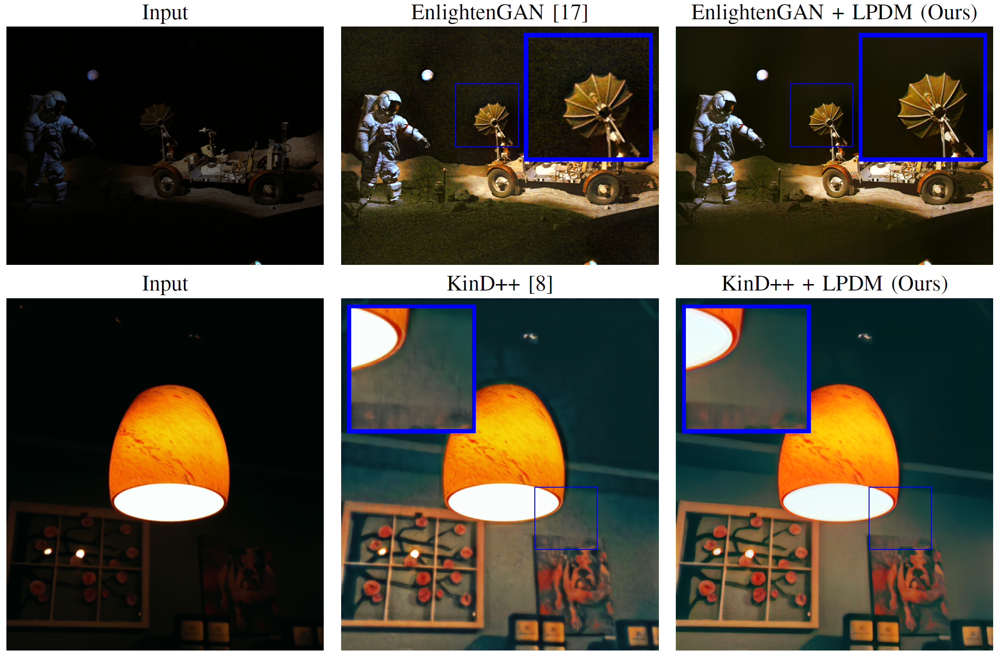

# Denoising Diffusion Post-Proecssing for Low-Light Image Enhancement


[](https://arxiv.org/pdf/2303.09627.pdf)
[](https://creativecommons.org/licenses/by-nc-sa/4.0/)

>**Abstract:** Low-light image enhancement (LLIE) techniques attempt to increase the visibility of images captured in low-light scenarios. However, as a result of enhancement, a variety of image degradations such as noise and color bias are revealed. Furthermore, each particular LLIE approach may introduce a different form of flaw within its enhanced results. To combat these image degradations, post-processing denoisers have widely been used, which often yield oversmoothed results lacking detail. We propose using a diffusion model as a post-processing approach, and we introduce Low-light Post-processing Diffusion Model (LPDM) in order to model the conditional distribution between under-exposed and normally-exposed images. We apply LPDM in a manner which avoids the computationally expensive generative reverse process of typical diffusion models, and post-process images in one pass through LPDM. Extensive experiments demonstrate that our approach outperforms competing post-processing denoisers by increasing the perceptual quality of enhanced low-light images on a variety of challenging low-light datasets. Source code is available at https://github.com/savvaki/LPDM.




----

## Download Results
The image results for all techniques and datasets are available for download [here](https://drive.google.com/drive/folders/119Uh8bVoeo_2NsUtaYaL77K_U229Uz06?usp=sharing).

- `undarken` directories contain $\hat{\boldsymbol{x}}_0^\eta$ for each low-light enhancement technique $\eta$. In other words, these are the results before post-processing.
- `denoised` directories contain the results of LPDM in the `lpdm_lol` subdirectory, as well as the results for the ablation studies. For the LOL dataset, the results of NAFNet and BM3D are also provided. BM3D results are provided for different values of $\sigma$. 
- The LPDM results have subdirectories in the format phi\_s which indicate the $\phi$ and $s$ parameters used.

----
## Requirements
Set up and activate the virtual [conda](https://docs.anaconda.com/anaconda/install/index.html) environment: 
- `conda env create -f environment.yml`
- `conda activate lpdm`

----
## Test 

- Download the pre-trained model `.ckpt` file and `.yaml` file [here](https://drive.google.com/drive/folders/17_nzmy8VlFWrcggDnwSWNjrcVoK4C_Nf?usp=sharing) and place them in the `checkpoints` directory:
    ```
    ───checkpoints
         ├───lpdm_lol.ckpt
         └───lpdm_lol.yaml
    ```
- Modify the `s` and `phi` (&phi;) parameters in `configs/test/denoise.yaml` as desired.
- Place your low-light images (c) in the `test/dark` directory
- Place your enhanced images by any enhancer &eta; in the `test/eta` directory. Make sure the images have the same names as the files in `test/dark`
- Run the following commands:
    ```
    cd scripts
    python denoise_config.py
    ```
- Denoised results can be found in `test/denoised`
- Run the following command for info about optional extra settings: `python denoise_config.py --help`. 
- By default, the device is set to CPU. To use GPU pass the argument `--device "cuda"`

### Calculate Metrics
- Modify `configs/test/metrics.yaml` and specify the denoised image glob path `pred_path` and the ground truth glob path `target_path`. To use non-reference metrics, remove `target_path` from the config.
- Run the following commands:
    ```
    cd scripts
    python calculate_metrics.py
    ```
- Metrics will be saved in `test/results.csv`. 
- For additional options run `python calculate_metrics.py --help` 
----

## Train

- Download the LOL Dataset [here](https://daooshee.github.io/BMVC2018website/). Unzip the dataset and place the contents in the `datasets/lol` directory:
    ```
    ───datasets
       └───lol
            ├───eval15
            │   ├───high
            │   └───low
            └───our485
                ├───high
                └───low
    ```
- For the commands below, PyTorch lightning will create a `logs` directory where checkpoints will be saved.
- For GPU training options pass the `--gpu` argument [according to PyTorch Lighting documentation](https://lightning.ai/docs/pytorch/latest/accelerators/gpu_basic.html#choosing-gpu-devices). The examples below use one GPU.
- Train and log locally:
    - `python main.py --base configs/train/lpdm_lol.yaml --gpu 0,`
- Train and log metrics with [wandb](https://docs.wandb.ai/):
    - Set your [wandb environment variables](https://docs.wandb.ai/guides/track): `WANDB_API_KEY`, `WANDB_ENTITY`, `WANDB_PROJECT`
    - `python main.py --base configs/train/lpdm_lol.yaml --logger_to_use wandb --gpu 0,`
 

- An example command to resume a saved checkpoint in the directory `RUN_DIRECTORY_NAME_HERE` using wandb logging:
    - `python main.py --resume logs/RUN_DIRECTORY_NAME_HERE --logger_to_use wandb --gpu 0,`

- To reduce the size of the model, reduce the `model_channels` parameter in `configs/train/lpdm_lol.yaml`

----
## BibTeX Citation

```
@misc{panagiotou2023denoising,
      title={Denoising Diffusion Post-Processing for Low-Light Image Enhancement}, 
      author={Savvas Panagiotou and Anna S. Bosman},
      year={2023},
      eprint={2303.09627},
      archivePrefix={arXiv},
      primaryClass={eess.IV}
}
```

----

## References
This repository is a derivative of the original [**Stable Diffusion**](https://github.com/CompVis/stable-diffusion) repository.


